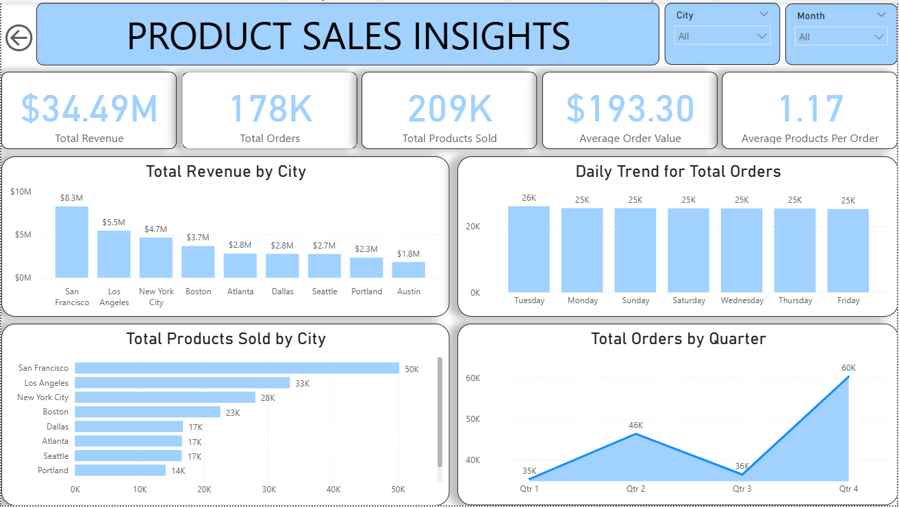
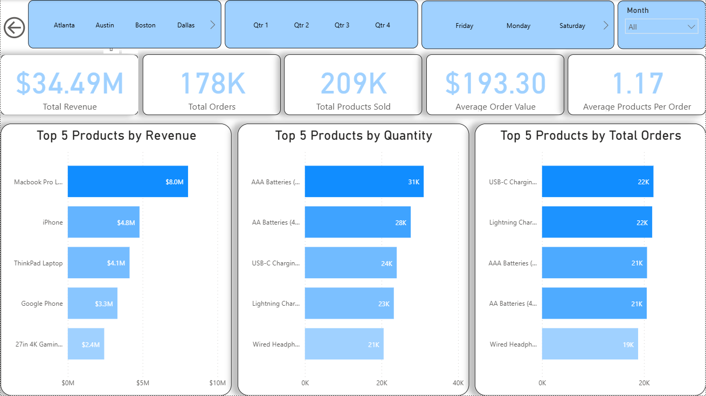

# Product Sales Insights Dashboard 📊

> A Power BI dashboard analyzing $34.49M in product sales across 9 U.S. cities, uncovering revenue trends, top-performing products, and order patterns by city, quarter, and day of the week.

---

## 📌 Overview

This dashboard was built to give sales teams and business stakeholders a comprehensive view of product sales performance across major U.S. cities. It answers key questions about where revenue is coming from, which products drive the most sales, and how order volume shifts across time dimensions including day of week, month, and quarter.

The dashboard features two pages with cross-filtering slicers for City, Quarter, Day, and Month, allowing flexible exploration of the data from multiple angles.

---

## 🖼️ Dashboard Preview

### Product Sales Insights

### Top Products Analysis

---

## 📋 Dashboard Pages

| Page | Description |
|------|-------------|
| Product Sales Insights | KPI cards, total revenue by city, daily order trends, total products sold by city, and total orders by quarter |
| Top Products Analysis | Top 5 products ranked by revenue, quantity sold, and total orders with city, quarter, and day slicers |

---

## 🔍 Key Insights

- Total revenue reached **$34.49M** across **178K orders** and **209K products sold**
- **San Francisco** leads all cities with **$8.3M** in revenue and **50K products sold**, nearly 50% more than the second city
- **Los Angeles** ranks second with **$5.5M** in revenue, followed by **New York City** at **$4.7M**
- **Q4** records the highest order volume at **60K orders**, more than any other quarter, while Q3 dips to **36K**
- **Tuesday** has the highest daily order count at **26K**, with all other days averaging around **25K**
- **Macbook Pro** is the top product by revenue at **$8.0M**, while **AAA Batteries** lead in quantity sold at **31K units**
- **USB-C Charging Cable** and **Lightning Charging Cable** tie for the most total orders at **22K each**
- Average order value across all transactions is **$193.30** with an average of **1.17 products per order**

---

## ⚙️ DAX Measures

| Measure | Description |
|---------|-------------|
| `Total Revenue` | Sum of total revenue across all orders |
| `Total Orders` | Count of all orders |
| `Total Products Sold` | Sum of all product quantities sold |
| `Average Order Value` | Average revenue per order |
| `Average Products Per Order` | Average number of products per order |

---

## 🔧 Advanced Features

- **Cross-page Slicers:** City, Quarter, Day, and Month slicers filter all visuals across both pages
- **Top 5 Rankings:** Three separate bar charts rank products by revenue, quantity, and total orders simultaneously
- **Navigation Button:** Back arrow button on the second page for easy page navigation

---

## 🛠️ Tools and Techniques

| Tool | Usage |
|------|-------|
| **Power BI Desktop** | Dashboard design, data modeling, DAX measures |

**Visualizations used:** KPI cards, Vertical bar charts, Horizontal bar charts, Line chart, Slicers

---

## 📁 Dataset

The dataset contains product sales transaction records including order details, product names, quantities, revenue, city, and date information.

📂 [View Dataset](data/Sales%20Data.csv)
